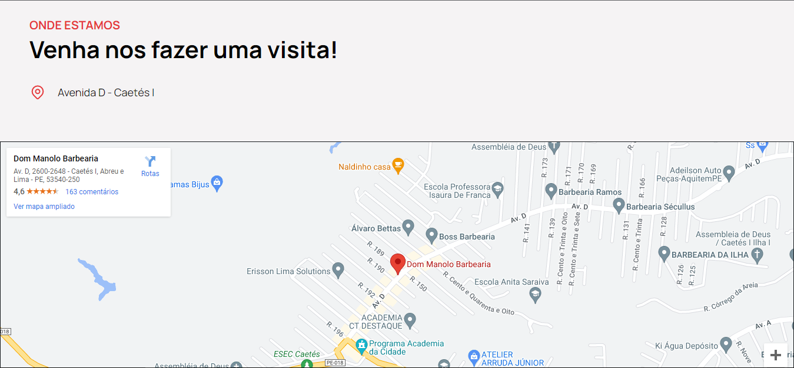
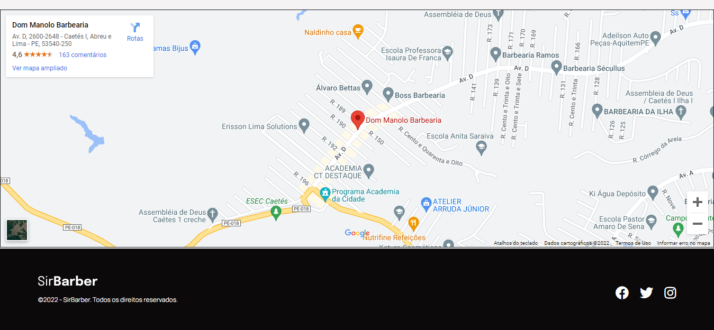

# [SirBarber](https://josephmatheus.github.io/barbershop-landing-page)
Landing Page de uma barbearia fictícia, criada com objetivo de por em prática nossos estudos de HTML, CSS e JavaScript.  
Este projeto foi inspirado pela <b>Maratona Starter</b> da [Codar.me](https://codar.me/)
___
## Screenshots 🖼

___
## Tecnologias utilizadas 🚀 

- HTML
- CSS
- JavaScript
___
## Autores 👨🏾‍💻👨🏻‍💻

### - [Jorge Ricardo](https://www.github.com/jorge-moraes)
### - [Joseph Matheus](https://www.github.com/josephmatheus)
___
